# 介紹
這是使用dev container作為本機開發環境的範例專案


# 問題
## 假設​

加入一個新的專案，需要在本機建置環境​

## 問題​

- 開發人員需要手動配置開發環境​
    - Python version​
    - vscode extension​
    - Install aws, git ...etc​

- 每個人的環境都不一致​
- 跟Prod環境不一致​
- 團隊有人用mac / windows​
- 重新建置很花時間/無自動化​

# 理想情況
- local開發環境可以納入版本控管​
- local開發環境與prod一致​
- local開發環境建立自動化​
- 不同的專案可以相互隔離​
- 可以跟本機環境相互隔離
# Dev container優點

使用 VS Code Dev Container 有以下優點：

1. 一致的開發環境：Dev Container 可以在容器中提供與主機相同的開發環境，包括所需的程式庫、工具和環境變數。這樣可以確保團隊成員使用的開發環境都是一致的，從而避免因為開發環境的不同而引起的問題。

2. 快速的環境設置：使用 Dev Container 可以快速地設置開發環境，因為你只需要在 VS Code 中設定一些配置，然後啟動 Dev Container 即可。這樣可以節省許多時間，特別是當你需要在不同的機器上設置相同的環境時。

3. 安全性：使用 Dev Container 可以確保開發環境與主機是分離的。這樣可以減少主機被攻擊的風險，同時也可以保護開發環境中的資料和程式碼。

4. 易於維護：Dev Container 通常是基於容器技術實現的，因此可以很容易地進行部署和維護。如果需要更新開發環境，只需要更新容器映像檔即可，不需要在主機上進行設置。

總之，使用 VS Code Dev Container 可以讓開發環境的設置更加容易和一致，同時也可以提高開發的安全性和可維護性。
# 前置作業
請於本機安裝好以下三個東西
- [vscode](https://code.visualstudio.com/download)
- [Docker Desktop](https://www.docker.com/products/docker-desktop/)
- [vscode extension - Remote Development](https://marketplace.visualstudio.com/items?itemName=ms-vscode-remote.vscode-remote-extensionpack)

# 如何快速體驗dev container
先使用`F1` 叫出命令視窗，再輸入`dev containers:try a dev container sample`
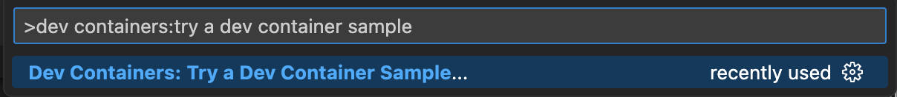

選擇要體驗哪種程式語言，我是選擇Python
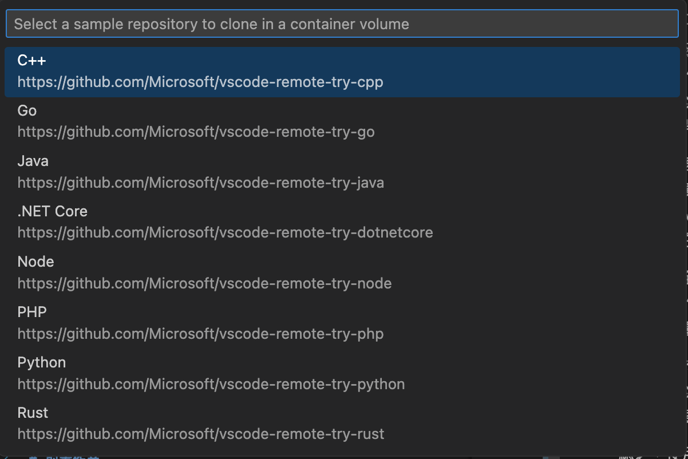

接著一直進入下一步，即可進行container中
ps：第一次因為要build image，會花比較多時間
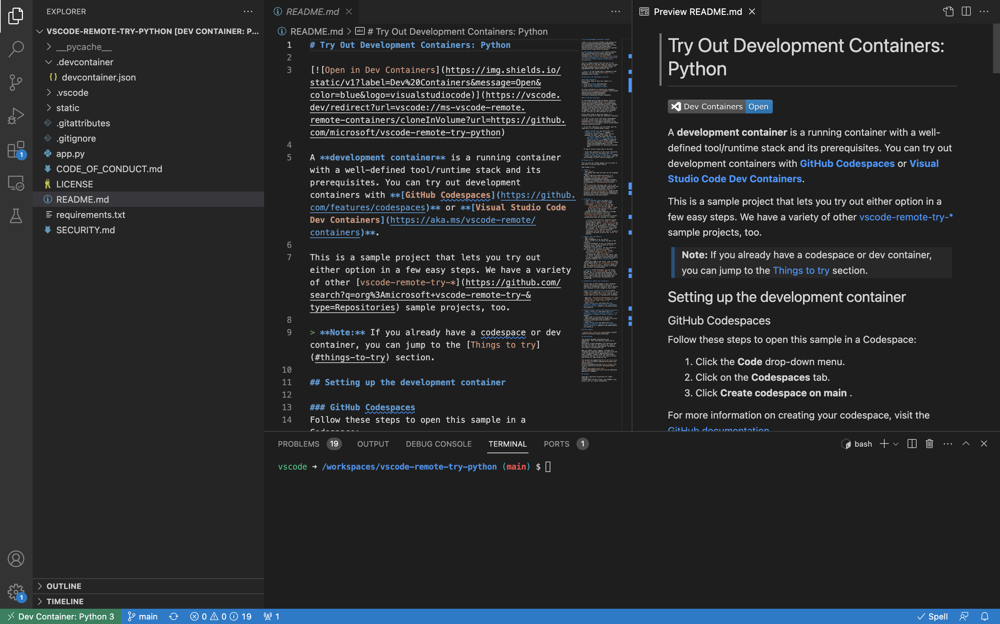

可以根據readme.md中的教學，執行語法啟動python service
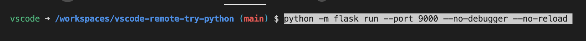

打開broswer顯示結果
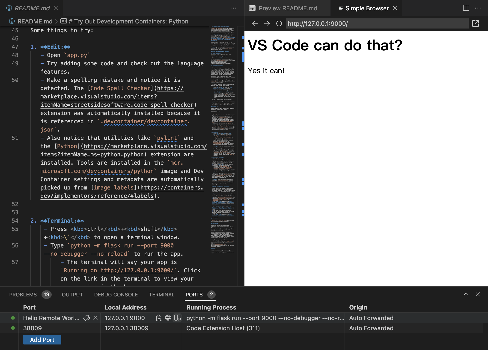

若要退出dev container的話，則可以點左下角的綠色圖示

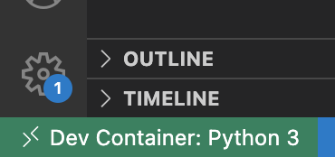

選擇`close remote connection`


# 如何在自己的專案中加入dev container
## 使用tutorial產生
按`F1` 叫出命令視窗，輸入`Dev containers: add dev container configuration files`

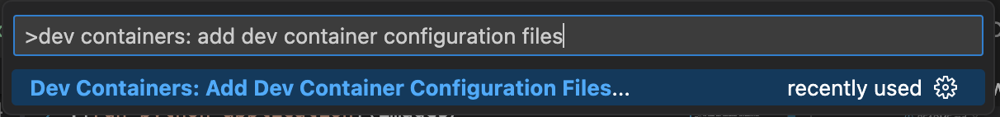

選擇base image, 這個選擇`Python 3`

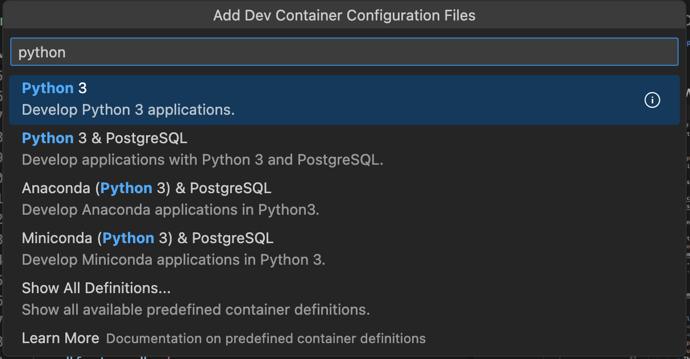

選擇Python 版號，這邊選擇3.10

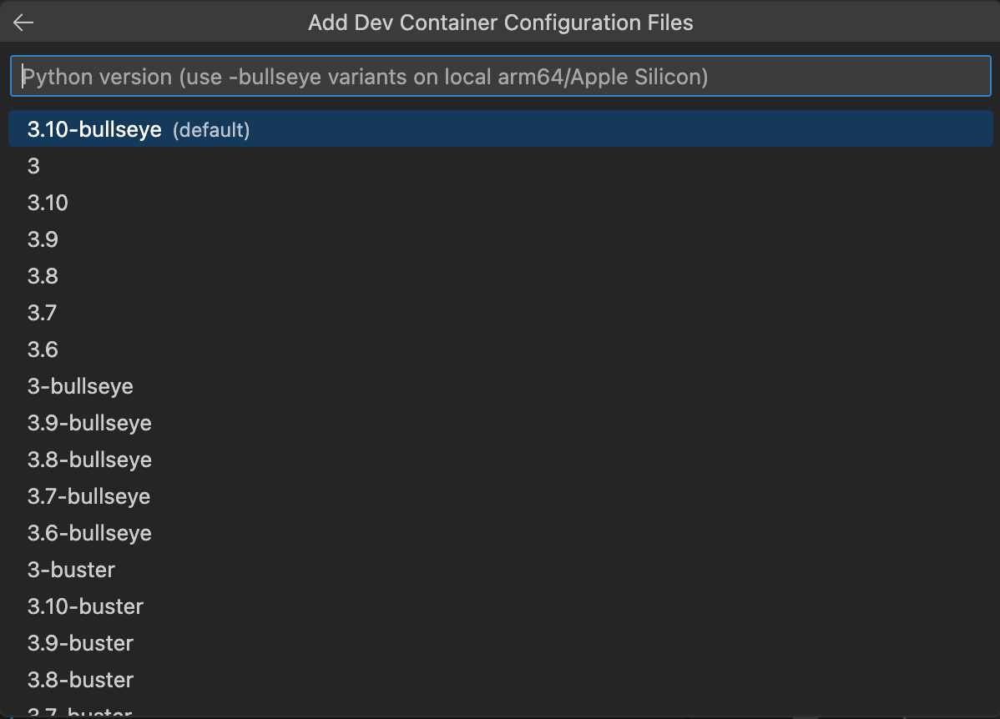

選擇Nodejs 版號，這邊選擇None


選擇想要安裝的features
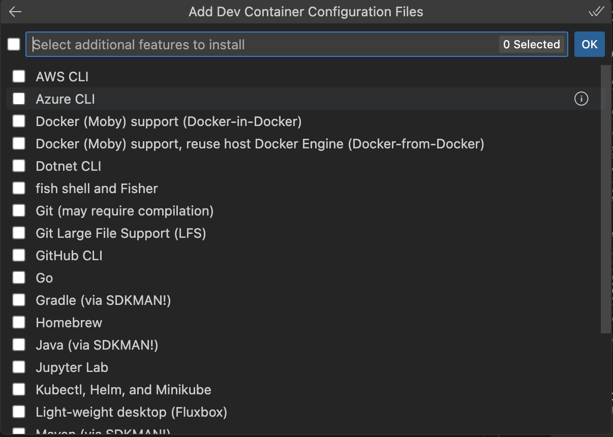

就會自動在`.devcontainer`的folder下產生
- devcontainer.json
- Dockerfile
## 修改內容

### settings
可以針對在dev container中的vscode進行設定
假設要調整vscode的字體大小
```
"settings":{
    "editor.fontSize": 13
}
```

### extension
在dev container中的vscode要預設安裝哪些plugin
假設要安裝
- Github Copilot
- python
- aws toolkit
- gitlens
- live share

以github copilot為例，可以先在extension中搜尋`Github Copilot`

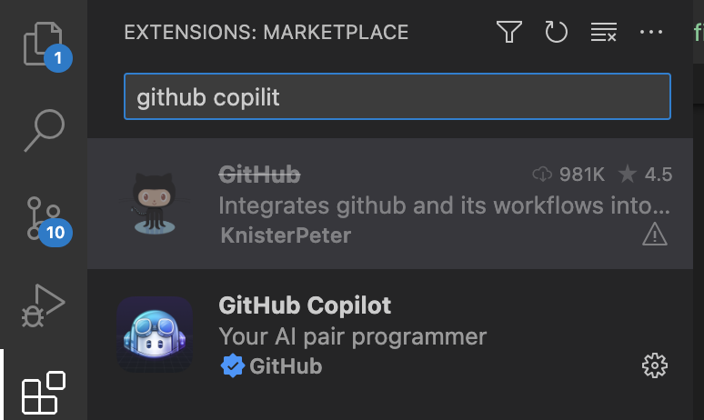

複制extension ID
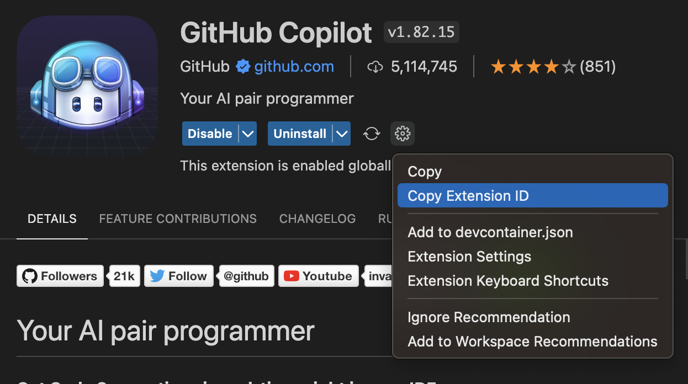

貼到exension中
```
"extensions": [
    "ms-python.python", // python extension
    "amazonwebservices.aws-toolkit-vscode", // aws toolkit
    "eamodio.gitlens", // gitlens
    "ms-vsliveshare.vsliveshare", // live share
    "GitHub.copilot" // copilot
]
```

### features
在`Select additional features to install`階段選擇要安裝的套件
舉例：若選擇aws cli及git, 則features會顯示
```
"features": {
    "git": "latest",
    "aws-cli": "latest"
}
```
ps: 當然要在Dockerfile中自己安裝也是可以的
### args - 傳變數給 container
若有一些變數是隱私的，不想上傳到git，但在build image的過程中又要傳給docker
可以使用 .env的方式

在`devcontainer.json`中，增加`.env`的位置
```
"runArgs": ["--env-file", ".devcontainer/devcontainer.env"]
```

進行dev container後，可以在環境變數中取得`.env`設定的值
如：
```
echo $AWS_ACCESS_KEY_ID
```
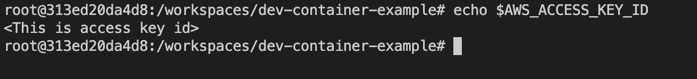

# Debug mode
在Dev container中也支援debug mode及break point
可以先在程式中設定break point
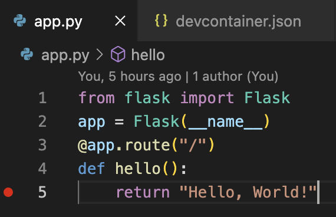

點選`Debug`Tab, 並執行`Run and Debug`, 啟動debug mode
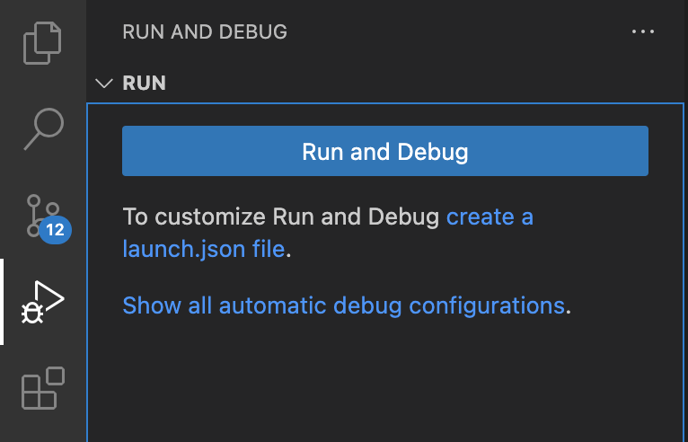

選擇debug configure, 這邊選擇`Flask`
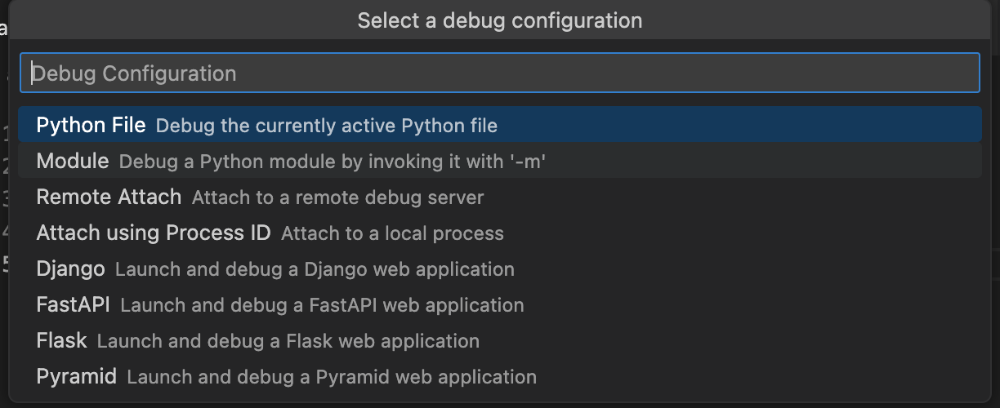

接著在broswer輸入`http://127.0.0.1:5000`
就會觸發debug mode, 並顯示相關資訊


# Dev container的優缺點
## 優點
- 開發環境標準化，可以使用跟prod相同的image​
- 建置開發環境自動化​
- 不必在本機安裝許多套件​
- 有效隔離每個專案的環境​
- 重建環境快速​
- 跨平台(mac, windows) 可以使用相同的環境開發​

## 缺點
- 無法發揮100%的電腦效能​
- 若存案多，local會有很多image​
- 需要有人加入remote development設定檔​
# Reference 
- https://www.tpisoftware.com/tpu/articleDetails/2575
